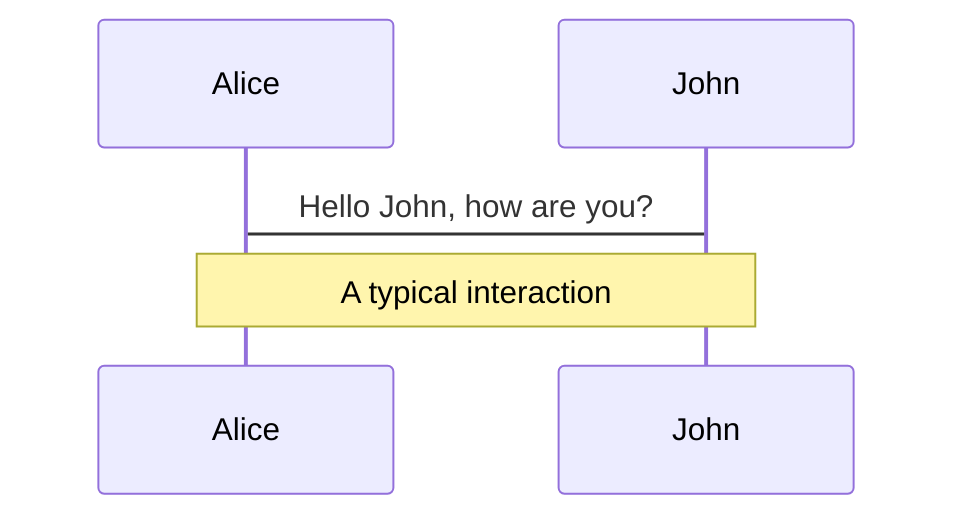
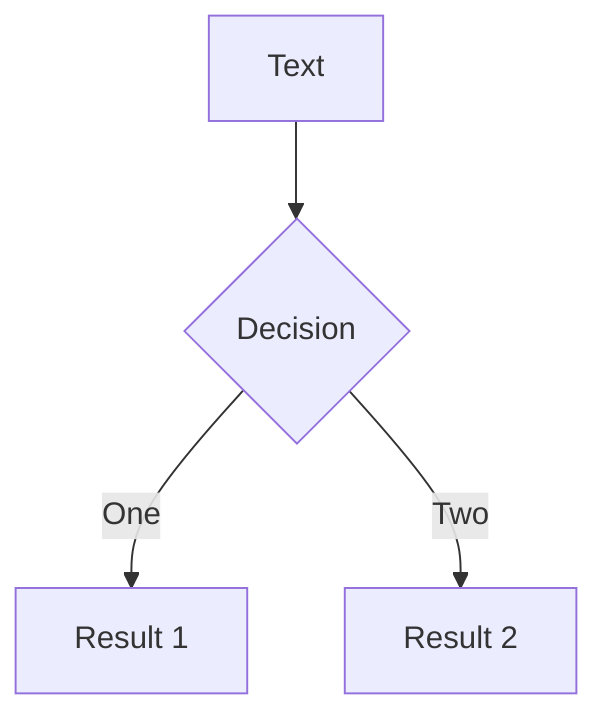
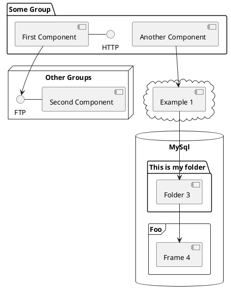

# Deep Learning from Scratch

밑바닥부터 시작하는 딥러닝

<!-- <div class="pt-12">
  <span @click="$slidev.nav.next" class="px-2 py-1 rounded cursor-pointer" hover="bg-white bg-opacity-10">
    Press Space for next page <carbon:arrow-right class="inline"/>
  </span>
</div> -->

<div class="abs-br m-6 flex gap-2">
  <button @click="$slidev.nav.openInEditor()" title="Open in Editor" class="text-xl slidev-icon-btn opacity-50 !border-none !hover:text-white">
    <carbon:edit />
  </button>
  <a href="https://github.com/LeeByeongdo/deeplearningfromscratch" target="_blank" alt="GitHub"
    class="text-xl slidev-icon-btn opacity-50 !border-none !hover:text-white">
    <carbon-logo-github />
  </a>
</div>

<!--
1. 안녕
2ㅏㅇ럼ㄴㅇ란ㅇㄹㅇㄴㄹ
-->

---
transition: fade-out
---

# 목표

간단한 숫자 이미지 인식 신경망 모델을 예시로, 학습이란 어떻게 이루어지는지 감을 잡아봅시다.

### 목차

- 👨‍💻 **개발 환경**
- 🔣 **퍼셉트론**
- 🧠 **신경망**
- 🏋🏿 **활성화 함수**
- 📖 **신경망 학습**
- ⟷ **손실함수**
- 🔙 **오차역전파**
- 🎬 **완성**

<br>
<br>

<!--
You can have `style` tag in markdown to override the style for the current page.
Learn more: https://sli.dev/guide/syntax#embedded-styles
-->

<style>
h1 {
  background-color: #2B90B6;
  background-image: linear-gradient(45deg, #4EC5D4 10%, #146b8c 20%);
  background-size: 100%;
  -webkit-background-clip: text;
  -moz-background-clip: text;
  -webkit-text-fill-color: transparent;
  -moz-text-fill-color: transparent;
}
</style>

<!--
- 언어로는 파이썬을 사용하며, 행렬 계산을 위해 numpy 라이브러리를 사용합니다.
- 다수의 입력을 받아 결과를 출력하는 퍼셉트론에 대해 알아봅니다.
- 퍼셉트론의 개념을 기반으로 신경망에 대해 이해합니다.
- 신경망에서 사용하는 활성화 함수에 대해 알아봅니다.
- 데이터로부터 어떻게 학습을 구현하는지 알아봅니다.
- 학습에서 사용하는 손실함수에 대하여 알아봅니다.
- 계산 그래프 방식으로 오차역전파에 대하여 이해합니다.
- 위의 내용을 종합하여 신경망을 완성합니다.
-->

---

# 👨‍💻 개발환경


|     |     |
| --- | --- |
| python| python은 기계학습과 데이터 과학 분야에서 널리 쓰입니다. |
| numpy | 수치 계산과 통계 처리를 해주는 라이브러리입니다. |
| matplotlib.pyplot | 그래프를 그려주는 라이브러리입니다. |
| mnist | 학습에 필요한 데이터를 제공해줍니다. |

<!-- https://sli.dev/guide/animations.html#click-animations

<p v-after class="absolute bottom-23 left-45 opacity-30 transform -rotate-10">Here!</p> -->

---

# 퍼셉트론

퍼셉트론은 다수의 입력을 받아 하나의 활성 또는 비활성 상태를 신호로 나타냅니다. (0 또는 1)

<br>

<div grid="~ cols-2 gap-2" m="-t-2">


$$
y = \begin{cases}
   0 &(w_1x_1 + w_2y_2 \leq \theta) \\
   1 &(w_1x_1 + w_2y_2 > \theta)
\end{cases} \\
\begin{align*} \\
&x_1, x_2: 입력 \\
&w_1, w_2: 가중치 \\
&\theta: 입계값
\end{align*}
$$

</div>

---

# 퍼셉트론 예제 - AND 게이트

퍼셉트론을 이용하여 AND 게이트를 구현할 수 있습니다.

$$
y = \begin{cases}
   0 &(w_1x_1 + w_2y_2 \leq \theta) \\
   1 &(w_1x_1 + w_2y_2 > \theta)
\end{cases}  

\enspace\enspace\enspace\enspace➡\enspace\enspace\enspace\enspace

y = \begin{cases}
   0 &(w_1x_1 + w_2y_2 + b \leq 0) \\
   1 &(w_1x_1 + w_2y_2 + b > 0)
\end{cases} \\
$$

<br />


<div grid="~ cols-2 gap-2" m="-t-2">

| $x_1$ | $x_2$ | y |
| ----- | ----- | - |
| 0     | 0     | 0 |
| 1     | 0     | 0 |
| 0     | 1     | 0 |
| 1     | 1     | 1 |

```python
def AND(x1, x2):
    x = np.array([x1, x2])
    w = np.array([0.5, 0.5])
    b = -0.7
    tmp = np.sum(w*x) + b
    if tmp <= 0:
        return 0
    else:
        return 1
```

</div>

---

# 퍼셉트론의 한계 

퍼셉트론을 이용하여 AND 게이트를 구현할 수 있습니다.

$$
y = \begin{cases}
   0 &(w_1x_1 + w_2y_2 + b \leq 0) \\
   1 &(w_1x_1 + w_2y_2 + b > 0)
\end{cases}
$$

<br />


<div grid="~ cols-2 gap-2" m="-t-2">

| $x_1$ | $x_2$ | y |
| ----- | ----- | - |
| 0     | 0     | 0 |
| 1     | 0     | 0 |
| 0     | 1     | 0 |
| 1     | 1     | 1 |

```python
def AND(x1, x2):
    x = np.array([x1, x2])
    w = np.array([0.5, 0.5])
    b = -0.7
    tmp = np.sum(w*x) + b
    if tmp <= 0:
        return 0
    else:
        return 1
```

</div>

---

# Code

Use code snippets and get the highlighting directly![^1]

```python
def AND(x1, x2):
    x = np.array([x1, x2])
    w = np.array([0.5, 0.5])
    b = -0.7
    tmp = np.sum(w*x) + b
    if tmp <= 0:
        return 0
    else:
        return 1
```

<arrow v-click="3" x1="400" y1="420" x2="230" y2="330" color="#564" width="3" arrowSize="1" />

[^1]: [Learn More](https://sli.dev/guide/syntax.html#line-highlighting)

<style>
.footnotes-sep {
  @apply mt-20 opacity-10;
}
.footnotes {
  @apply text-sm opacity-75;
}
.footnote-backref {
  display: none;
}
</style>

---

# Components

<div grid="~ cols-2 gap-4">
<div>

You can use Vue components directly inside your slides.

We have provided a few built-in components like `<Tweet/>` and `<Youtube/>` that you can use directly. And adding your custom components is also super easy.

```html
<Counter :count="10" />
```

<!-- ./components/Counter.vue -->
<Counter :count="10" m="t-4" />

Check out [the guides](https://sli.dev/builtin/components.html) for more.

</div>
<div>

```html
<Tweet id="1390115482657726468" />
```

<Tweet id="1390115482657726468" scale="0.65" />

</div>
</div>

<!--
Presenter note with **bold**, *italic*, and ~~striked~~ text.

Also, HTML elements are valid:
<div class="flex w-full">
  <span style="flex-grow: 1;">Left content</span>
  <span>Right content</span>
</div>
-->


---
class: px-20
---

# Themes

Slidev comes with powerful theming support. Themes can provide styles, layouts, components, or even configurations for tools. Switching between themes by just **one edit** in your frontmatter:

<div grid="~ cols-2 gap-2" m="-t-2">

```yaml
---
theme: default
---
```

```yaml
---
theme: seriph
---
```


</div>

Read more about [How to use a theme](https://sli.dev/themes/use.html) and
check out the [Awesome Themes Gallery](https://sli.dev/themes/gallery.html).

---
preload: false
---

# Animations

Animations are powered by [@vueuse/motion](https://motion.vueuse.org/).

```html
<div
  v-motion
  :initial="{ x: -80 }"
  :enter="{ x: 0 }">
  Slidev
</div>
```

<div class="w-60 relative mt-6">
  <div class="relative w-40 h-40">
    
    
    
  </div>

  <div
    class="text-5xl absolute top-14 left-40 text-[#2B90B6] -z-1"
    v-motion
    :initial="{ x: -80, opacity: 0}"
    :enter="{ x: 0, opacity: 1, transition: { delay: 2000, duration: 1000 } }">
    Slidev
  </div>
</div>

<!-- vue script setup scripts can be directly used in markdown, and will only affects current page -->
<script setup lang="ts">
const final = {
  x: 0,
  y: 0,
  rotate: 0,
  scale: 1,
  transition: {
    type: 'spring',
    damping: 10,
    stiffness: 20,
    mass: 2
  }
}
</script>

<div
  v-motion
  :initial="{ x:35, y: 40, opacity: 0}"
  :enter="{ y: 0, opacity: 1, transition: { delay: 3500 } }">

[Learn More](https://sli.dev/guide/animations.html#motion)

</div>

---

# LaTeX

LaTeX is supported out-of-box powered by [KaTeX](https://katex.org/).

<br>

Inline $\sqrt{3x-1}+(1+x)^2$

Block
$$
\begin{array}{c}

\nabla \times \vec{\mathbf{B}} -\, \frac1c\, \frac{\partial\vec{\mathbf{E}}}{\partial t} &
= \frac{4\pi}{c}\vec{\mathbf{j}}    \nabla \cdot \vec{\mathbf{E}} & = 4 \pi \rho \\

\nabla \times \vec{\mathbf{E}}\, +\, \frac1c\, \frac{\partial\vec{\mathbf{B}}}{\partial t} & = \vec{\mathbf{0}} \\

\nabla \cdot \vec{\mathbf{B}} & = 0

\end{array}
$$

<br>

[Learn more](https://sli.dev/guide/syntax#latex)

---

# Diagrams

You can create diagrams / graphs from textual descriptions, directly in your Markdown.

<div class="grid grid-cols-3 gap-10 pt-4 -mb-6">







</div>

[Learn More](https://sli.dev/guide/syntax.html#diagrams)

---
src: ./pages/multiple-entries.md
hide: false
---

---
layout: center
class: text-center
---

# Learn More

[Documentations](https://sli.dev) · [GitHub](https://github.com/slidevjs/slidev) · [Showcases](https://sli.dev/showcases.html)
